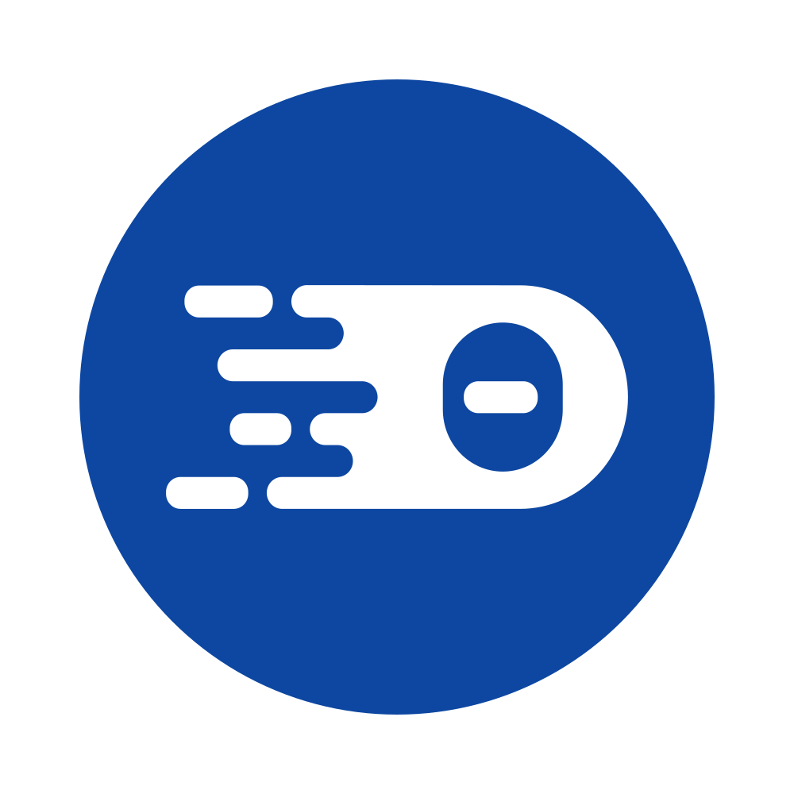

<div align='center'>
<br />


<h2>ECLIPSE THEIA - C/C++ EXTENSIONS</h2>

<div id="badges" align="center">

  [](https://gitpod.io#https://github.com/eclipse-theia/theia-cpp-extensions)
  [](https://github.com/eclipse-theia/theia-cpp-extensions/labels/help%20wanted)
  [](https://github.com/eclipse-theia/theia-cpp-extensions/actions?query=branch%3Amaster)
  [](https://github.com/eclipse-theia/theia-cpp-extensions/labels/question)
  [](https://github.com/eclipse-theia/theia-cpp-extensions/labels/bug)


</div>

</div>

## Overview

Collection of Theia extensions, APIs, and other tools related to C/C++ development.

## Features

- `@theia/cpp-debug`:
    - Debugging support using `GDB` through the `cdt-gdb-vscode` extension.
    - Memory view (monitor process memory during debug sessions).
    - See the [package readme][cdbg] for further details.
- `@theia/clangd-contexts`:
    - Library for management of [clangd][clangd] configuration files
    - Retrieve and set contexts in one or more `.clangd` files
    - Manage compile flags in `.clangd` files
    - See the [package readme][cclib] for further details.
- `@theia/clangd-contexts-cli`
    - An example command-line tool (`clangd-context`) built on the `@theia/clangd-contexts` API for management of [clangd][clangd] configuration files in C/C++ projects.
    - See the [package readme][cccli] for details, including a step-by-step guide to the CLI.
- `theia-clangd-contexts-ext`
    - An example VS Code extension demonstrating use of the `@theia/clangd-contexts` API.
    - See the [package readme][ccvsx] for details, including a step-by-step guide to the extension UI.
- `@theia/cpp` **deprecated** and **removed** ([past sources][cpp]):
    - **Deprecated** C/C++ language-features extension.\
        (Language-features should instead be contributed by VS Code extensions).

[cdbg]: ./packages/cpp-debug/README.md
[cclib]: ./packages/clangd-contexts/README.md
[cccli]: ./examples/clangd-contexts-cli/README.md
[ccvsx]: ./examples/clangd-contexts-ext/README.md
[cpp]: https://github.com/eclipse-theia/theia-cpp-extensions/tree/184f7751f13e1ec021ccae3f076915867168d28d/packages/cpp
[clangd]: https://clangd.llvm.org

## How to build

### Packages and Examples

To build the monorepo:

```bash
$ yarn
```

Additionally, to make the `clangd-context` example CLI tool available in your C/C++ projects
(such as the [clangd workspace](#example-workspaces) example):

```bash
$ cd examples/clangd-contexts-cli
$ yarn link
```

> **Note** that on some Linux installations you may need to ensure that Yarn's global bin directory is in your shell path:

```bash
    $ export PATH=$(yarn global bin):$PATH
```

### Example Theia Deployments

The `browser-app` and `electron-app` directories contain examples of Theia-based applications which use the extensions
provided by the repository.

- `browser-app` build instructions:

    ```bash
    $ yarn
    $ yarn start:browser
    ```

- `electron-app` build instructions:
    ```bash
    $ yarn
    $ yarn start:electron
    ```

## Example Packages

- [`clangd-contexts-cli`][cccli]
    - provides a command-line tool that demonstrates usage of the clangd contexts API
- [`clangd-contexts-ext`][ccvsx]
    - an example VS Code extension that demonstrates usage of the clangd contexts API

## Example Workspaces

- [`cpp-debug-workspace`][cdbgws]
    - provides an easy and reproducible way to test the functionality present in the `@theia/cpp-debug` extension. Includes a simple C/C++ program, debug launch configuration file (`launch.json`), and a task in order to compile the program (`tasks.json`).
- [`clangd-workspace`][ccws]
    - provides a test playground for the `clangd-context` example CLI tool and the API, including the separate [VS Code extension example](./examples/clangd-contexts-ext/README.md)

[cdbgws]: ./examples/cpp-debug-workspace/README.md
[ccws]: ./examples/clangd-workspace/README.md

## License

- [Eclipse Public License 2.0](http://www.eclipse.org/legal/epl-2.0/)
- [一 (Secondary) GNU General Public License, version 2 with the GNU Classpath Exception](https://projects.eclipse.org/license/secondary-gpl-2.0-cp)

## Trademark

"Theia" is a trademark of the Eclipse Foundation  
https://www.eclipse.org/theia
